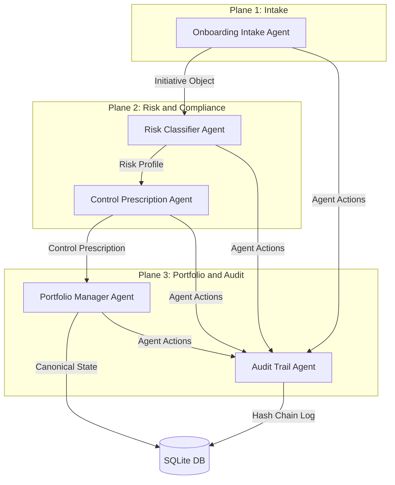

# Glasswing: Multi-Agent AI Governance System

Glasswing is an advanced, multi-agent AI governance system designed to automate structured initiative intake, risk classification, control prescription, portfolio state tracking, and cryptographic audit logging. It is built as a modular python system suitable for enterprise integration and regulatory compliance.

## Problem
Modern enterprises are deploying LLMs and agentic workflows at a rapid pace. However, governing these initiatives is highly manual, error-prone, and slow. Existing governance frameworks (like the EU AI Act, NIST AI RMF, and Colorado SB 205) are complex and hard to map to software systems consistently. Without automation, organizations face compliance violations, unmitigated alignment failures, and untrackable shadow AI deployments.

## Solution
Glasswing resolves this by deploying a collaborative plane of autonomous governance agents that coordinate to shepherd an AI initiative from intake to deployment:
1. **Automated Intake**: A conversational interface that collects system profiles structured as metadata.
2. **Deterministic & Agentic Compliance evaluation**: An agent querying regulatory taxomomies via a custom Model Context Protocol (MCP) server.
3. **Control Prescription**: Dynamic generation of required technical guardrails and human-in-the-loop checkpoints.
4. **Portfolio State Tracking**: Maintain a queryable database inventory of all active AI initiatives.
5. **Cryptographic Audit Logs**: Tamper-evident logging of all agent steps for regulator-ready reporting.

## Architecture
The system consists of five distinct agents across three planes:



### Regulatory Framework MCP Server
A custom MCP server provides the taxonomy rules for:
- **EU AI Act**: Four risk tiers (Unacceptable, High, Limited, Minimal/None).
- **NIST AI RMF**: Four functions (Govern, Map, Measure, Manage).
- **Colorado SB 205**: Criteria for high-risk consequential decisions.

## Setup
To set up the project locally:

1. **Clone the repository**:
   ```bash
   git clone https://github.com/username/glasswing.git
   cd glasswing
   ```

2. **Ensure Python 3.11 is installed**.

3. **Install Dependencies**:
   Using `pip`:
   ```bash
   pip install -e .
   ```
   Or using a virtual environment:
   ```bash
   python -m venv .venv
   source .venv/bin/activate  # On Windows: .venv\Scripts\activate
   pip install -e ".[dev]"
   ```

4. **Environment Variables**:
   Copy `.env.example` to `.env` and fill in the required keys:
   ```bash
   cp .env.example .env
   ```

5. **Start the MCP Server**:
   ```bash
   python mcp_server/server.py
   ```

6. **Run the Streamlit Dashboard**:
   ```bash
   streamlit run ui/app.py
   ```

## Demo Walkthrough
1. **Conversation Intake**: Navigate to the Streamlit UI. Enter details of a new proposed AI model (e.g., an automated resume screening system).
2. **Multi-Agent Evaluation**:
   - The **Onboarding Intake Agent** structures the details.
   - The **Risk Classifier Agent** contacts the MCP server and flags it as "High Risk" under the EU AI Act due to employment decision-making.
   - The **Control Prescription Agent** issues a manifest of required mitigations (e.g., bias monitoring, human audit).
   - The **Portfolio Manager Agent** saves the record as "Pending Controls".
3. **Audit Inspection**: Review the cryptographic logs generated by the **Audit Trail Agent** to see the full decision-making chain.

## Security Features
- **Tamper-Evident Hash Chain**: The `Audit Trail Agent` builds a cryptographic blockchain-like ledger where each entry contains the SHA-256 hash of the previous log entry.
- **Audit Replay Framework**: System audit history can be replayed to verify state integrity and confirm no entries have been modified.
- **Adversarial Testing Suite**: Red teaming test scripts that attempt to inject malicious overrides and verify that the risk classifier and compliance controls cannot be bypassed.
