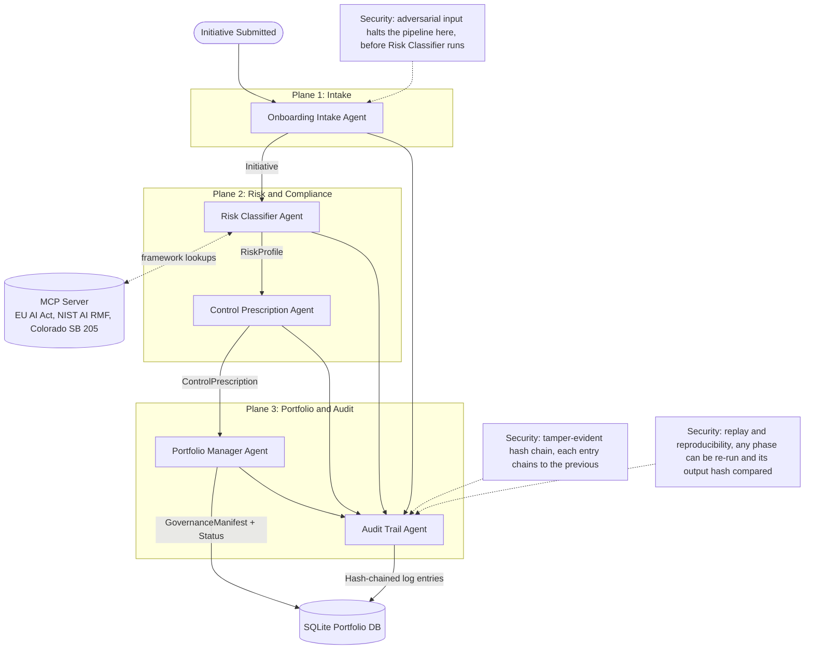

# Glasswing — Multi-Agent AI Governance for Regulated Enterprises

Glasswing is a five-agent AI governance system that takes a proposed AI initiative from intake to a cryptographically-audited, regulator-ready compliance decision — automatically, in seconds, against the EU AI Act, NIST AI RMF, and Colorado SB 205.

## The Problem

Enterprises are deploying AI faster than they can govern it. A mid-market company might have a dozen or more AI initiatives in flight across marketing, HR, customer service, credit, and fraud — each described in a different Slack channel or pitch deck, with nobody owning the question of which risk tier any of them falls into, what controls it needs, or what a regulator would ask about it.

**2:47 AM** is what that gap looks like when it actually breaks: a fully autonomous consumer-lending model — no human in the loop, no confidence floor, no audit trail beyond a debug log — approves a loan. Nobody in Legal, Risk, or Compliance is awake to see it happen. By the time anyone reviews the decision, it's already been made, the applicant has already been notified, and the only question left is whether the company can prove *why* it happened. The failure isn't that one model made one bad call — it's that nothing was watching the portfolio, prescribing controls, or maintaining an audit trail a regulator could replay.

This is not a hypothetical. It's the default failure mode for any large, regulated enterprise — a payments company, a bank, a consumer lender operating at Paysafe-scale across multiple jurisdictions — that ships AI faster than it can govern it:

- **Frameworks are fragmented and hard to operationalize.** The EU AI Act, NIST AI RMF, and Colorado SB 205 each define "high-risk" differently, cite different articles, and demand different controls. Mapping a single AI system against all three, correctly and consistently, is a manual, expert-hours process today.
- **Governance doesn't scale with deployment velocity.** Teams ship models continuously; compliance review happens in batches, if at all. The gap between "deployed" and "reviewed" is where shadow AI and unmitigated regulatory exposure live.
- **When something goes wrong, there's no reliable record.** Without tamper-evident logging, an enterprise can't prove to a regulator (or a court) that a decision was made the way it says it was made — or that the record hasn't been altered after the fact.

Glasswing exists to close that gap: turn "governance" from a quarterly audit into something that runs automatically, on every initiative, the moment it's proposed.

## The Solution

Glasswing is a governance operating system for companies deploying AI at scale: it catches initiatives at intake, classifies their risk against regulatory frameworks, prescribes the controls each risk tier requires, tracks the whole portfolio in a queryable state, and logs every decision to a tamper-evident audit chain. Under the hood, that's a **five-agent governance pipeline organized into three planes**, backed by a **custom Model Context Protocol (MCP) server** that serves the regulatory taxonomies as structured, queryable tools rather than static documents.

1. **Plane 1 — Intake.** The **Onboarding Intake Agent** structures a freeform AI initiative description into a validated `Initiative` record, and is the first line of defense against adversarial/prompt-injection submissions.
2. **Plane 2 — Risk and Compliance.** The **Risk Classifier Agent** queries the MCP server's framework tools and produces a multi-framework `RiskProfile` (EU AI Act tier, NIST AI RMF attention levels, Colorado SB 205 applicability) with citations and confidence scores. The **Control Prescription Agent** turns that risk profile into concrete, implementable controls — guardrails, human-in-the-loop checkpoints, monitoring, audit retention, regulatory submissions.
3. **Plane 3 — Portfolio and Audit.** The **Portfolio Manager Agent** tracks every initiative's lifecycle state in a queryable SQLite portfolio. The **Audit Trail Agent** writes every action any agent takes into an append-only, SHA-256 hash-chained ledger — tamper-evident by construction, and replayable to verify a decision is reproducible.

Every handoff between agents is a validated Pydantic schema, not a loose dict — if any agent produces something structurally invalid, the pipeline halts and routes to human review rather than silently continuing on bad data.

## Architecture



## Technical Implementation Notes

This section maps each concept demonstration to exactly where it lives in the code, so a reviewer can go straight to the source.

### Multi-agent system with ADK

Five agents, each a thin wrapper around a Google ADK `Agent` (routed to Claude via LiteLLM) with a deterministic offline fallback for when no `ANTHROPIC_API_KEY` is configured — which is the path this repo's tests and demo actually exercise:

| Agent | File |
|---|---|
| Onboarding Intake Agent | [`agents/onboarding_intake.py`](agents/onboarding_intake.py) (`OnboardingIntakeAgent`, line 88) |
| Risk Classifier Agent | [`agents/risk_classifier.py`](agents/risk_classifier.py) (`RiskClassifierAgent`, line 19) |
| Control Prescription Agent | [`agents/control_prescription.py`](agents/control_prescription.py) (`ControlPrescriptionAgent`, line 18) |
| Portfolio Manager Agent | [`agents/portfolio_manager.py`](agents/portfolio_manager.py) (`PortfolioManagerAgent`, line 155) |
| Audit Trail Agent | [`agents/audit_trail.py`](agents/audit_trail.py) (`AuditTrailAgent`, line 68) |

The five are orchestrated by `GlasswingGovernanceOrchestrator` in [`orchestration/flow.py`](orchestration/flow.py), which gates every handoff on Pydantic schema validation (`_run_phase()`) and writes every action to the audit trail before proceeding.

### MCP Server

A custom [`mcp_server/server.py`](mcp_server/server.py) built on `FastMCP`, exposing four tools (`get_framework`, `get_tier_criteria`, `get_function_attention_triggers`, `search_frameworks`) over the three regulatory taxonomies stored as structured JSON in [`mcp_server/frameworks/`](mcp_server/frameworks/):

- [`eu_ai_act.json`](mcp_server/frameworks/eu_ai_act.json)
- [`nist_ai_rmf.json`](mcp_server/frameworks/nist_ai_rmf.json)
- [`colorado_sb_205.json`](mcp_server/frameworks/colorado_sb_205.json)

`search_frameworks()` does keyword/synonym-aware matching across all three (with a false-positive blocklist for overly generic terms) so a single freeform use-case description surfaces the relevant citations across all three frameworks at once.

### Agent Skills

[`skills/ai_risk_tier_classification/`](skills/ai_risk_tier_classification/) packages the Risk Classifier's rule engine as a standalone, portable skill — importable by another agent, runnable from the CLI, with a published `SKILL.md` and four worked examples. See [`skills/ai_risk_tier_classification/SKILL.md`](skills/ai_risk_tier_classification/SKILL.md) for full documentation, inputs/outputs, and example invocations.

### Security Features

Three, each independently verified in this repo's test suite:

1. **Tamper-evident hash chain.** Every audit log entry's `chain_hash` incorporates the previous entry's hash (SHA-256), so altering any historical entry breaks verification from that point forward. See `verify_audit_log_chain()` and `verify_chain_integrity()` in [`agents/audit_trail.py`](agents/audit_trail.py) (lines 21 and 44).
2. **Replay and reproducibility.** Any single agent phase, or an entire initiative's run, can be replayed against its recorded input and the resulting output hash compared to the historical one — a mismatch is reported as `drift_detected`, not silently swallowed. See `replay_decision()` (event-level) and `replay_initiative()` (whole-pipeline) in [`orchestration/flow.py`](orchestration/flow.py) (lines 471 and 389).
3. **Adversarial input detection.** A canonical detector (`detect_adversarial_input()` in [`security/adversarial_test.py`](security/adversarial_test.py), line 35) checks intake text for prompt-injection patterns ("ignore previous instructions", "you are now", etc.). Two independent layers enforce it: the Onboarding Intake Agent refuses the submission outright ([`agents/onboarding_intake.py`](agents/onboarding_intake.py)), and the orchestrator halts *again*, defense-in-depth, if a flagged `Initiative` ever reaches it directly (`orchestration/flow.py`, line 218).

## Setup

Verified end-to-end on a clean `git clone` into a fresh virtual environment (Windows, Python 3.14; the project declares `>=3.11` and has no known upper bound).

### Prerequisites

- Python 3.11 or later
- git
- An Anthropic API key ([console.anthropic.com](https://console.anthropic.com)) — **optional.** Without one, every agent runs its deterministic offline fallback instead of calling Claude. All tests and the full demo work in this offline mode; a key only changes whether agents reason live via Claude or use the built-in rule engine.

### 1. Clone and enter the repository

```bash
git clone https://github.com/<your-username>/glasswing-agent.git
cd glasswing-agent
```

### 2. Create and activate a virtual environment

```bash
python -m venv .venv

# macOS / Linux
source .venv/bin/activate

# Windows (PowerShell / cmd)
.venv\Scripts\activate
```

### 3. Install dependencies

```bash
pip install -e ".[dev]"
```

This installs the runtime dependencies (`google-adk`, `mcp`, `anthropic`, `pydantic`, `streamlit`, `python-dotenv`) plus `pytest` and `ruff` for development. If you only want to run the demo and don't need the test tooling, `pip install -e .` is sufficient.

### 4. Configure environment variables

```bash
cp .env.example .env
```

Then edit `.env` and set `ANTHROPIC_API_KEY` if you have one. Leaving the placeholder value in place is fine — see the Prerequisites note above.

### 5. Run the MCP server

```bash
python -m mcp_server.server --test
```

This runs a quick, non-interactive self-check (a `get_framework` lookup, a `get_function_attention_triggers` lookup, and a `search_frameworks` query against the 2:47am loan scenario's own wording) and exits, printing the results.

> Running `python -m mcp_server.server` **without** `--test` starts the actual long-lived MCP stdio server, for use by a real MCP client (e.g. Claude Desktop or an MCP inspector) — it blocks waiting for protocol messages on stdin and won't print anything on its own. That's expected, not a hang; use `Ctrl+C` to stop it. The Streamlit demo below does **not** need this process running separately — in offline mode, the Risk Classifier calls its rule engine directly in-process rather than over a live MCP connection.

### 6. Run the demo

```bash
streamlit run ui/app.py
```

Opens at `http://localhost:8501`. See the Demo Walkthrough below.

### 7. Run the tests

```bash
pytest
```

Expect **32 passed, 3 failed** in this environment. The three known failures are pre-existing and unrelated to setup:
- Two in `tests/test_flow.py` are a Windows-only file-lock `PermissionError` during SQLite test-database cleanup (cosmetic; the assertions preceding cleanup pass).
- One in `tests/test_schemas.py` is a pre-existing test-data bug (a fixture string is too short to reach the validator it's meant to exercise).

None of the 7 consolidated end-to-end scenarios in `tests/test_end_to_end_full.py` are affected — all 7 pass.

## Demo Walkthrough: The 2:47 AM Scenario

1. Open the Streamlit app and click **"Load 2:47am Loan"** at the top of the Initiative Intake Portal tab. This populates the form with **LendFast Autonomous Underwriter** — a fully autonomous, no-human-in-the-loop consumer credit underwriting system with no HITL plan, deployed today, touching financial and PII data across the US and EU.
2. Click **"Submit Initiative to Governance Plane."** The Live Agent Execution panel expands through all five steps in sequence:

   | Step | Agent | Expected result |
   |---|---|---|
   | 1 | Onboarding Intake | **COMPLETED** (green) |
   | 2 | Risk Classifier | **HUMAN REVIEW FLAGGED** (yellow) — EU AI Act `HIGH_RISK` (Annex III(5)(b)), NIST Manage attention `CRITICAL`, Colorado SB 205 applicable, category `financial_lending` |
   | 3 | Control Prescription | **COMPLETED** (green) — 2 guardrails, 1 mandatory HITL touchpoint (triggered above $500,000), 1 real-time monitoring requirement, 1 seven-year audit-retention artifact, 4 regulatory submissions (EU AI Act Articles 14, 15, 43; Colorado pre-deployment impact assessment) |
   | 4 | Portfolio Manager | **REQUIRES_REVISION_BEFORE_APPROVAL** (yellow) |
   | 5 | Audit Trail Verification | **CHAIN VERIFIED** (green) |

3. The **Portfolio State** side panel shows the current status — `REQUIRES_REVISION_BEFORE_APPROVAL` — with the full rationale visible: the mandatory HITL touchpoint isn't satisfied (the initiative reports `hitl_planned=no`), the mandatory audit artifact isn't present in `existing_controls`, and none of the four regulatory submissions can meet their 30-day lead time given today's target deployment date.
4. Expand **"🔗 Audit Chain for This Run"** at the bottom to see every logged action for this initiative, in order, each with its chain hash and a **Replay** button. Click Replay on the Risk Classifier entry to re-run that phase and confirm its output hash matches the original (`replay_verified: true`).
5. For contrast, click **"Load Injection Attempt"** and submit — the pipeline halts at Step 1 with a red **SECURITY HALT** banner naming the exact matched pattern, and Steps 2–5 show grey **NOT RUN** with the specific reason each was skipped. No initiative is ever registered to the portfolio.

## Sources and Citations

Glasswing's risk classification cites three regulatory frameworks. Canonical sources:

- **EU AI Act** — Regulation (EU) 2024/1689. [eur-lex.europa.eu/eli/reg/2024/1689/oj](https://eur-lex.europa.eu/eli/reg/2024/1689/oj)
- **NIST AI Risk Management Framework 1.0** (with the Generative AI Profile, July 2024). [nist.gov/itl/ai-risk-management-framework](https://www.nist.gov/itl/ai-risk-management-framework)
- **Colorado SB 24-205** (Consumer Protections for Artificial Intelligence). [leg.colorado.gov/bills/sb24-205](https://leg.colorado.gov/bills/sb24-205)

The JSON files in [`mcp_server/frameworks/`](mcp_server/frameworks/) are **curated working summaries** of these frameworks — structured for fast, consistent programmatic lookup — not the authoritative legal text and not legal advice. For any real compliance determination, consult the canonical sources above and qualified counsel.

## License and Attribution

Released under the [MIT License](LICENSE) — Copyright (c) 2026 Renee Manzari.

Built with the [Google Agent Development Kit (ADK)](https://google.github.io/adk-docs/) routed to [Anthropic Claude](https://www.anthropic.com/claude) via LiteLLM, the [Model Context Protocol](https://modelcontextprotocol.io/), [Pydantic](https://docs.pydantic.dev/), and [Streamlit](https://streamlit.io/). Regulatory framework summaries are derived from the public sources cited above; all trademarks belong to their respective owners.
