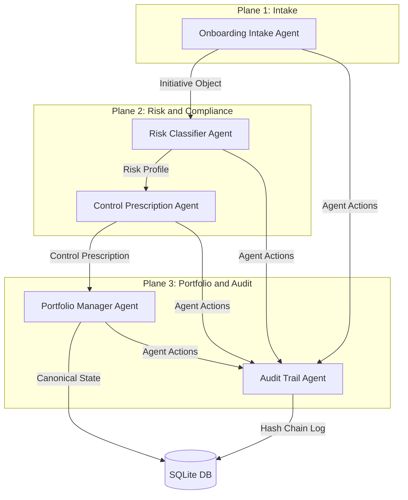

# Glasswing Governance Architecture

This document describes the architectural layout, design principles, and data flow of the Glasswing AI Governance Control Plane.

## Architectural Planes

The system operates across three logical planes separating user intake, compliance logic, and persistence:

### 1. Plane 1: Intake
- **Onboarding Intake Agent**: Runs conversational sessions to capture initiative attributes. It translates transcripts into Pydantic validation models matching the `Initiative` schema definition.

### 2. Plane 2: Risk and Compliance
- **Risk Classifier Agent**: Queries custom MCP server tools to look up regulatory frameworks (EU AI Act, NIST AI RMF, Colorado SB 205). Maps features of the initiative deterministically and heuristic-wise to output a `RiskProfile`.
- **Control Prescription Agent**: Maps elements of the `RiskProfile` (like a "High Risk" tier) to specific technical guardrails, human review checkpoints, and logging demands, outputting a `ControlPrescription`.

### 3. Plane 3: Portfolio and Audit
- **Portfolio Manager Agent**: Acts as the database controller, committing manifests to SQLite and tracking transition timelines.
- **Audit Trail Agent**: Intercepts events, checks logs, and updates an append-only cryptographic log chain.

---

## Cryptographic Hash Ledger

To enforce compliance integrity, every agent action writes to an append-only cryptographic block chain structure:

$$\text{Signature}_n = \text{SHA256}(\text{BlockID}_n \parallel \text{Signature}_{n-1} \parallel \text{PayloadHash}_n)$$

If any entry in the database is modified retroactively, the hash verification chain breaks at that index, flagging human oversight. This protects logs from unauthorized administrator overrides or deletion.
